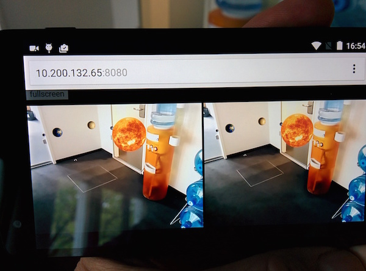
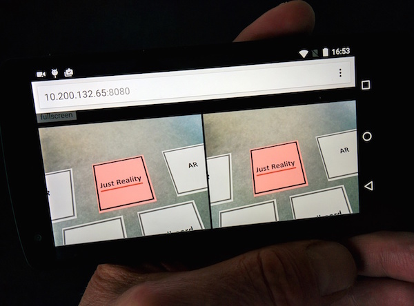
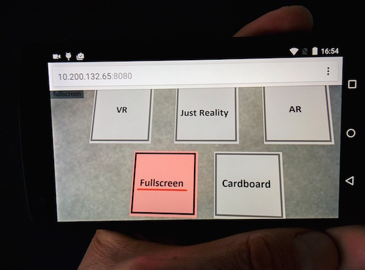

# webgl-cardboard-boilerplate

This prototype is an example of showing AR (Augmented Reality) and VR (Virtual Reality) views in the chrome browser on mobile devices.

## Pictures

##Idea

The Camera view is combined with a WebGL view (via [ThreeJS](http://threejs.org)) which gives the AR experience. You can switch between the modes by 'looking' at the tiles on the bottom.

The initial idea and source code came from Tim Samshuijzen of [complexity.zone](http://complexity.zone/cardboard_solarsystem/) fame.

We re-iterated on this idea and created this git.

## Demo
A demo is [here](http://curious-electric.com/lab/webgl-cardboard-boilerplate/).
